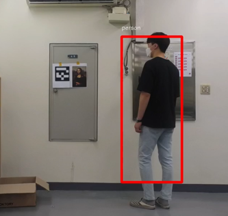
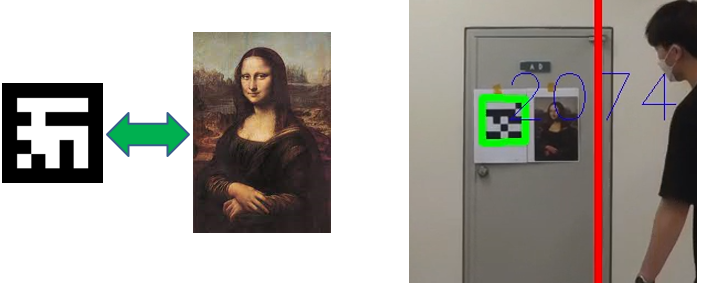

# Curator Drone

## Final video

## Procedure

### Tracking

* Used Yolo framework to recognize people.
* Using red box and simple algorithm, I was able to track people.

  

### AR-Marker

* Used AR-Marker to recognize the paintings.
* Each painting is designated to certain AR-Marker.

### crawling (This wasn't my part of the project.)

* When the painting is recognized, drone automatically searches for the painting in Wikipedia.
* Then it sends an information and its audio file via email to the user.

## Limitations
* I wasn't able to make drone rotate around the user, since the yolo-tiny wasn't accurate enough.
* Drone and laptop have to be nearby, since they are connected by wifi. So I need to find a new way to connect the drone and server.
* When drone searches for information drone stops until the searching is finished. Which may occur problem.

## What I've learned
* How to use Yolo framework in embedded system.
* How to cooperate with other developers.
* How to combine others' work and make it work!

